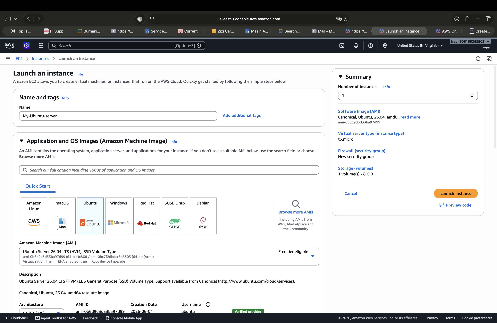
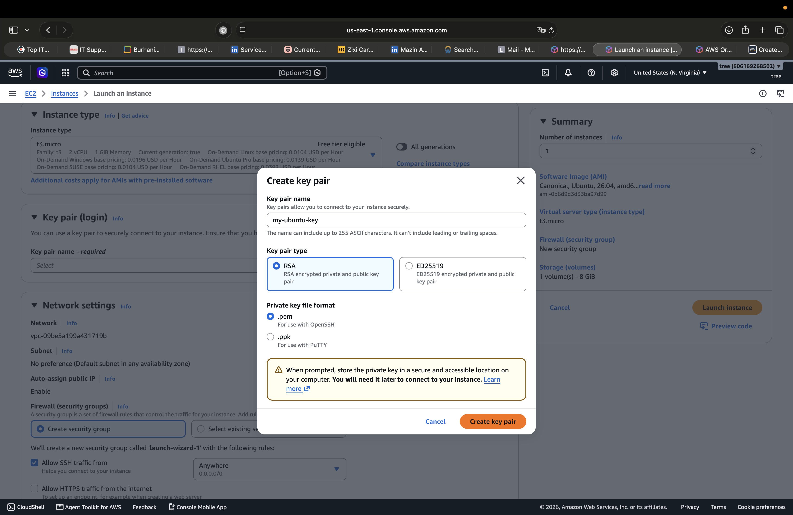
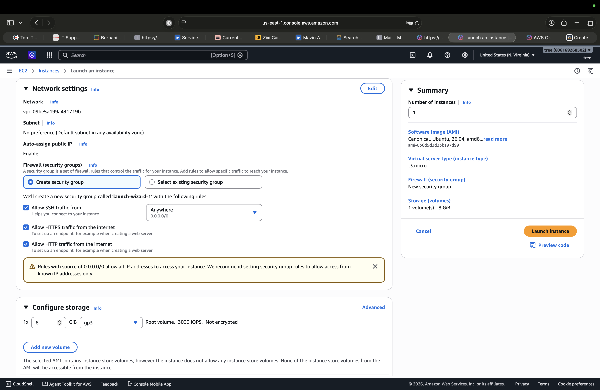

# 💻 AWS EC2 — Instance Deployment & SSH Access

## 📌 Overview

This lab demonstrates the deployment of an **Amazon EC2 instance** using an Ubuntu Server AMI and establishing secure SSH access to the instance.

The lab covers the basic process of launching a cloud-based virtual server, configuring a key pair, configuring network access through a Security Group, and connecting to the instance using SSH.

---

## 🎯 Objective

The objectives of this lab are to:

* Launch an EC2 instance using an Ubuntu Server AMI.
* Select an appropriate EC2 instance type.
* Create and configure an EC2 Key Pair.
* Configure network access using a Security Group.
* Connect to the EC2 instance using SSH.
* Verify that the instance is running correctly.
* Perform basic Linux commands after connecting to the instance.

---

## ⚙️ Configuration

### 1. Launch EC2 Instance

An EC2 instance was created using the following configuration:

* **Operating System:** Ubuntu Server 26.04 LTS
* **Architecture:** 64-bit (x86)
* **Instance Type:** `t3.micro`
* **Storage:** 8 GiB gp3
* **Region:** US East (N. Virginia)
* **Instance Name:** `My-Ubuntu-server`



The `t3.micro` instance type was selected as it was shown as **Free tier eligible** in the AWS console.

---

### 2. Create Key Pair

A Key Pair was created to securely authenticate with the EC2 instance.

Configuration:

* **Key Pair Name:** `my-ubuntu-key`
* **Key Pair Type:** RSA
* **Private Key Format:** `.pem`



The private key is required to establish an SSH connection to the instance.

---

### 3. Configure Network & Security Group

A new Security Group was configured during the instance launch.

The Security Group controls inbound network traffic to the EC2 instance.

The following rules were configured:

* **SSH (Port 22)** — allowed for remote administration.
* **HTTP (Port 80)** — allowed.
* **HTTPS (Port 443)** — allowed.



> **Security Note:** Allowing SSH from `0.0.0.0/0` permits SSH access from any IPv4 address. For production environments, SSH access should be restricted to trusted IP addresses or managed through more secure access mechanisms.

---

## 🔐 SSH Connection

After launching the instance, an SSH connection was established successfully.

The EC2 instance provided an Ubuntu shell environment:

```text
ubuntu@ip-172-31-16-218:~$