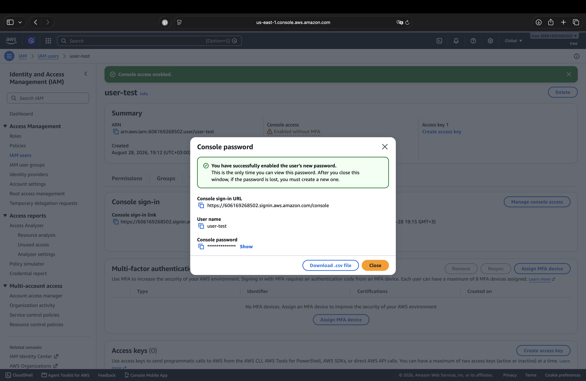
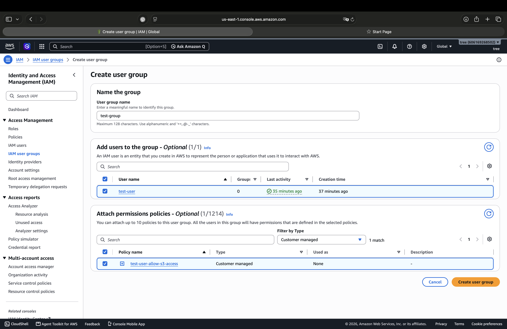
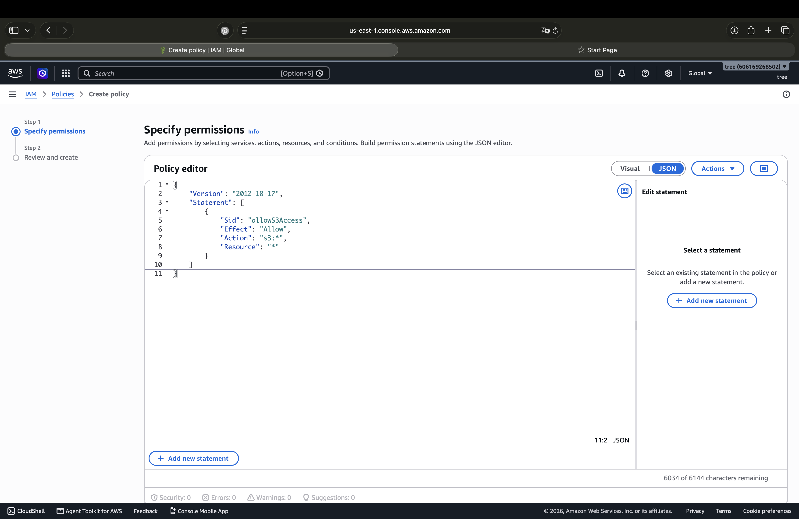
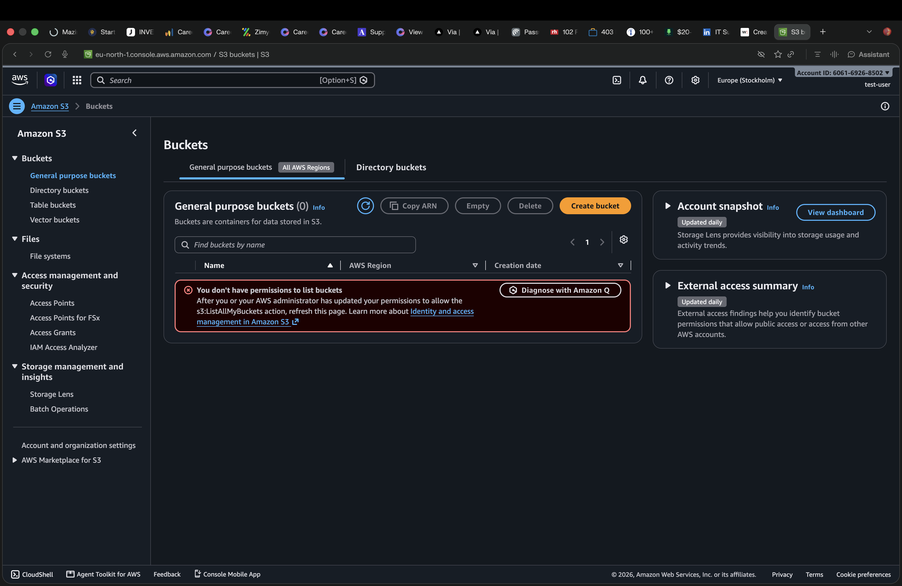
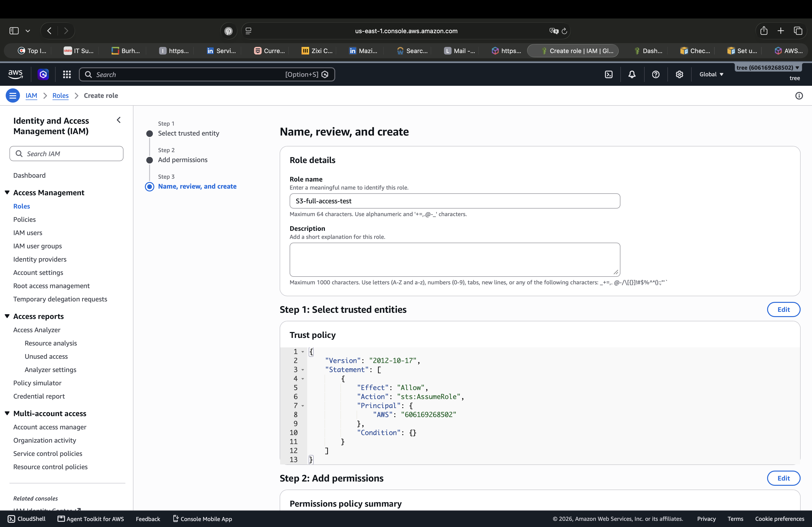
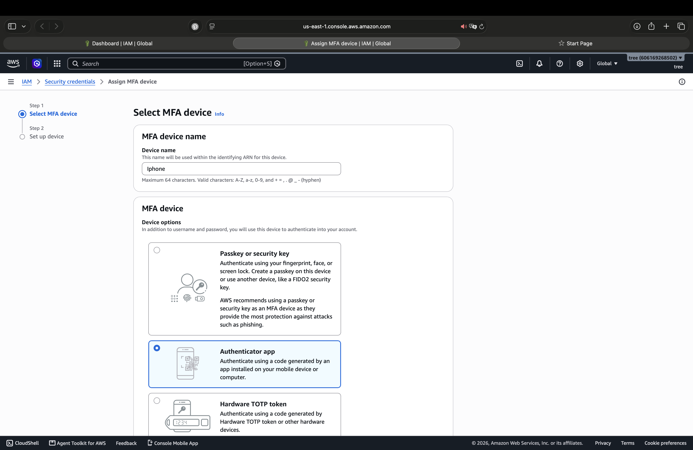

# 🔐 AWS IAM Lab

## 📌 Overview

In this lab, I practiced AWS Identity and Access Management (IAM)
to understand how users, groups, policies, roles, and MFA are
used to manage access to AWS resources.

## 🛠️ Environment

- Amazon Web Services (AWS)
- AWS IAM

---

## 1. 👤 IAM User

I created a test IAM user and enabled console access for the user.

---

## 2. 👥 IAM Group

I created an IAM user group and added the test user to the group.

Using groups allows permissions to be managed for multiple users
based on their role or job function.

---

## 3. 🔐 IAM Policy

I created and applied an IAM policy to control what actions
the user is allowed to perform.

The policy used in this lab provided access to Amazon S3.

### Permission Testing

I tested the user's permissions by accessing Amazon S3.
The user was denied permission to list S3 buckets because
the required `s3:ListAllMyBuckets` permission was not granted.

---

## 4. 🎭 IAM Role

I created and reviewed an IAM Role to understand how roles
can provide permissions to AWS services or trusted entities.

Unlike an IAM user, a role does not represent a permanent
individual identity. It provides permissions that can be
assumed when needed.

---

## 5. 🛡️ Multi-Factor Authentication (MFA)

I configured MFA using an authenticator application to add
an additional layer of security to the IAM user.

---

## 6. 🔑 Access Keys

I reviewed the purpose of AWS access keys for programmatic
access to AWS services.

> Access keys and secret keys must never be shared or uploaded
> to GitHub.

---

## 🎯 Skills Practiced

- IAM Users
- IAM Groups
- IAM Policies
- IAM Roles
- Multi-Factor Authentication (MFA)
- Access Management
- AWS Security Fundamentals

---

## 📚 What I Learned

- How IAM users are created and managed.
- How groups can be used to organize users and permissions.
- How IAM policies control access to AWS resources.
- How IAM roles provide permissions to trusted entities.
- Why MFA is important for securing AWS accounts.
- The difference between console access and programmatic access.