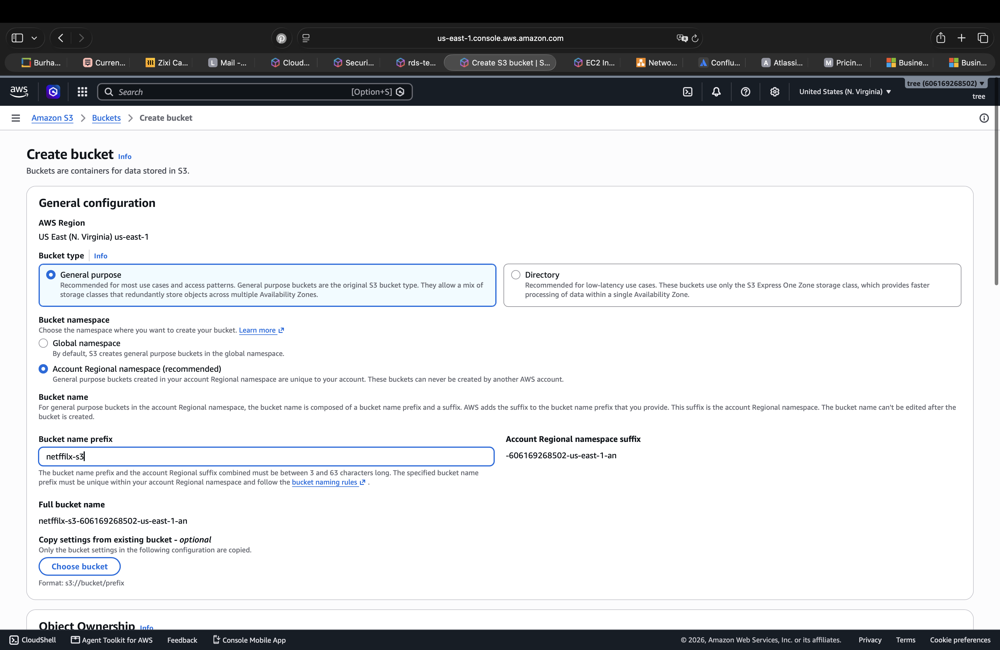
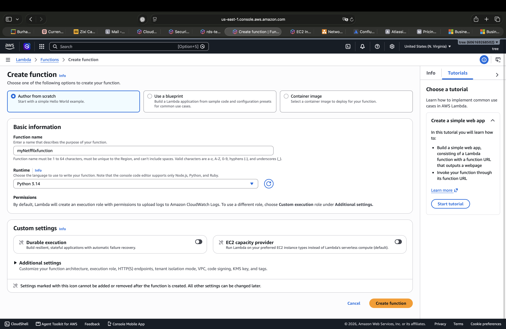
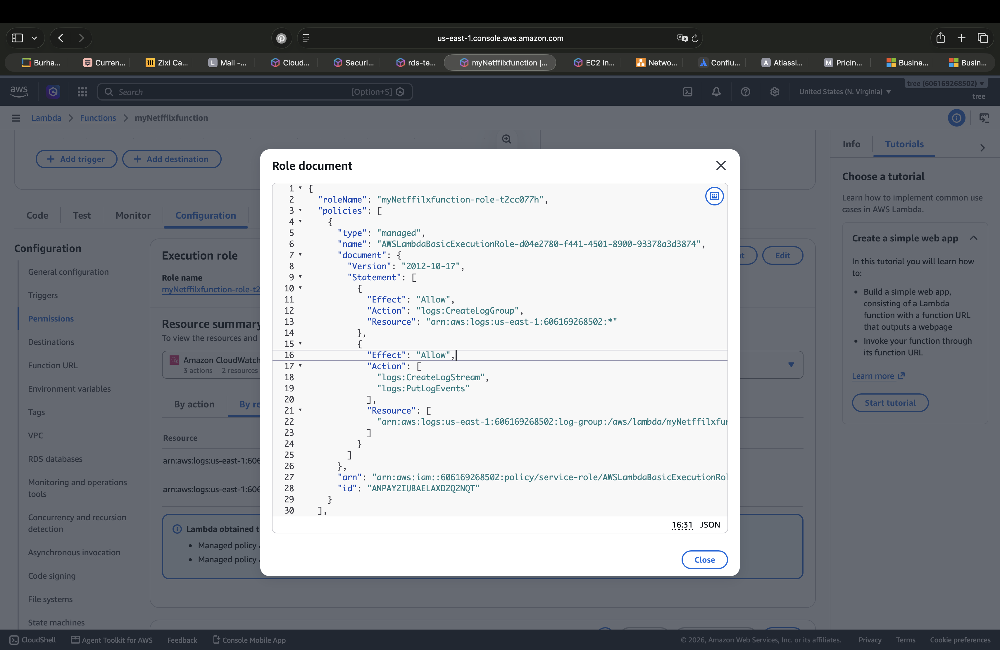
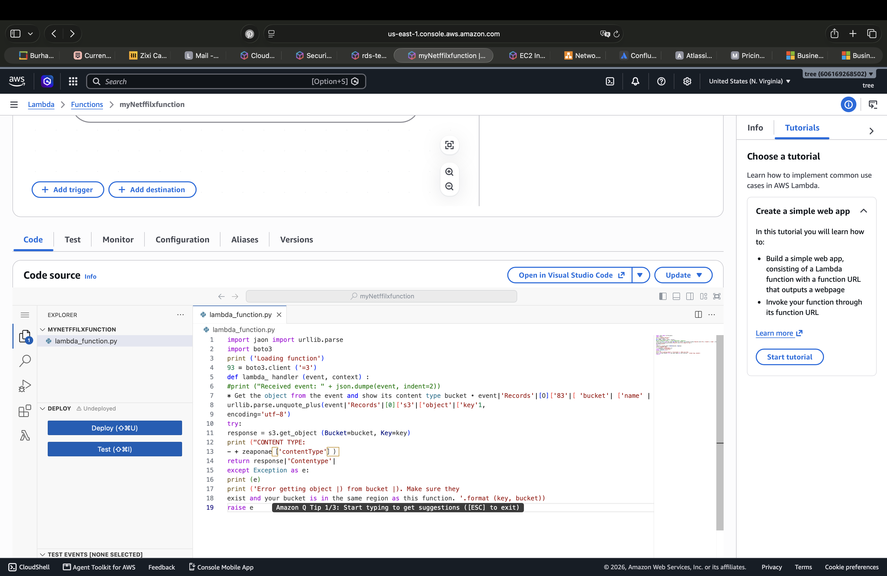
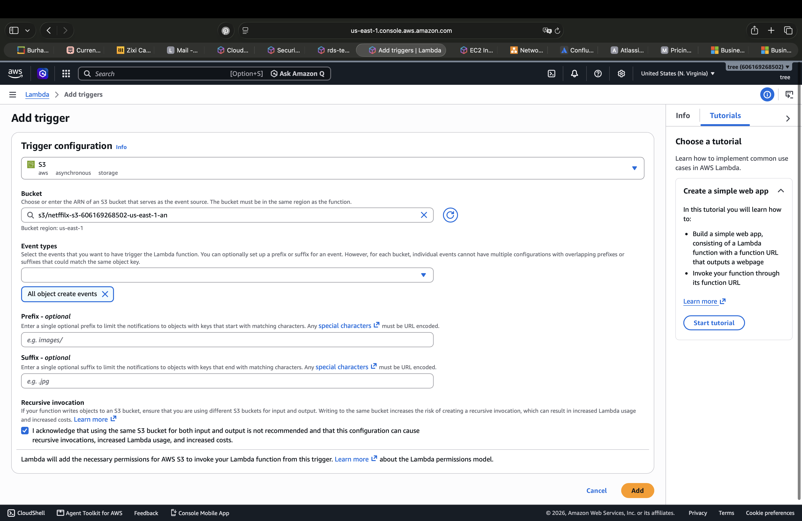
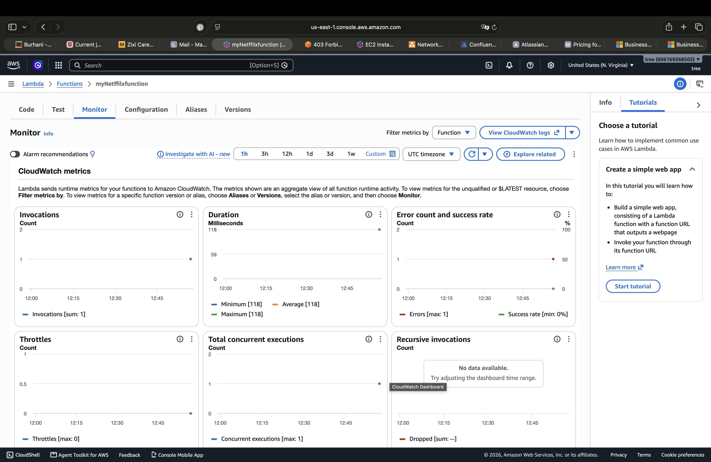
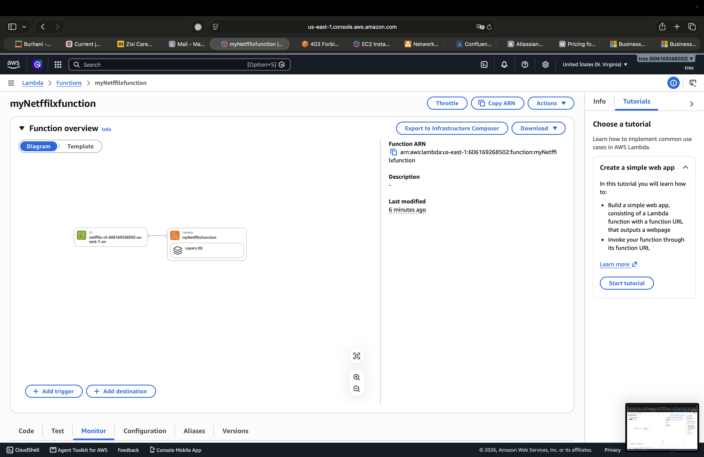

# ⚡ AWS Lambda + S3 Event-Driven Lab

## 📌 Overview

Hands-on AWS Lambda lab demonstrating how a serverless function can be integrated with Amazon S3 using an event-driven architecture.

The lab covers Lambda function creation, Python runtime configuration, execution roles, S3 event triggers, and Lambda monitoring.

---

## 🏗 Environment

- **AWS Region:** US East (N. Virginia) — `us-east-1`
- **Amazon S3**
- **AWS Lambda**
- **Python 3.14**
- **Amazon CloudWatch**
- **IAM Execution Role**

---

## 1. Create an S3 Bucket

Created an Amazon S3 bucket to act as the storage source for the Lambda event-driven workflow.

The bucket was configured in the `us-east-1` region.

---

## 2. Create the Lambda Function

Created a Lambda function named `myNetflixfunction` using:

- **Author from scratch**
- **Python 3.14**
- AWS-managed execution role

The Lambda function provides the serverless compute component of the lab.

---

## 3. Review the Lambda Execution Role

Reviewed the Lambda execution role and its permissions.

The role includes permissions required for Lambda to create and write logs to Amazon CloudWatch Logs.

This demonstrates the relationship between **Lambda and IAM execution roles**.

---

## 4. Review the Lambda Python Code

The Lambda function uses Python and the AWS SDK for Python (`boto3`) to interact with Amazon S3.

The function is designed to process information from an S3 event and retrieve an S3 object using the S3 API.

Key concepts demonstrated:

- Python Lambda handler
- `boto3`
- Amazon S3 API
- Event-driven processing

---

## 5. Configure an S3 Trigger

Configured Amazon S3 as a trigger for the Lambda function.

The trigger was configured for:

- **S3 bucket:** `netflix-s3-606169268502-us-east-1-an`
- **Event type:** All object create events
- **Region:** `us-east-1`

This creates an event-driven relationship where an S3 object creation event can invoke the Lambda function.

---

## 6. Monitor Lambda Activity

Reviewed the Lambda monitoring metrics through the AWS console.

The monitoring view shows Lambda runtime metrics including:

- Invocations
- Duration
- Error count
- Success rate
- Throttles
- Concurrent executions
- Recursive invocations

The displayed metrics provide visibility into Lambda execution behavior.

---

## 7. Review the Lambda Architecture

Reviewed the Lambda function overview and its relationship with Amazon S3.

The architecture shows:

**Amazon S3 → AWS Lambda**

This represents a basic serverless, event-driven architecture where S3 acts as the event source and Lambda provides the compute logic.

---

## 🧠 Key Concepts Learned

- AWS Lambda
- Serverless computing
- Lambda execution roles
- IAM permissions
- Python Lambda functions
- `boto3`
- Amazon S3 event triggers
- Event-driven architecture
- Lambda monitoring
- CloudWatch Logs and metrics

---

## 🛠 Tools Used

- Amazon S3
- AWS Lambda
- IAM
- Amazon CloudWatch
- Python 3.14
- Boto3
- AWS Management Console

---

## 🎯 Skills Practiced

- Serverless Computing
- AWS Lambda
- S3 Event-Driven Architecture
- IAM Roles & Permissions
- Python
- AWS SDK (`boto3`)
- Cloud Monitoring
- AWS Cloud Engineering

---

## 🚨 Security Relevance

AWS Lambda is highly relevant to Cloud Security because serverless functions commonly interact with sensitive AWS resources.

Understanding Lambda execution roles, IAM permissions, event triggers, and monitoring provides a foundation for later security tasks such as:

- Least-privilege IAM
- Security automation
- Automated incident response
- S3 security monitoring
- Event-driven security workflows
