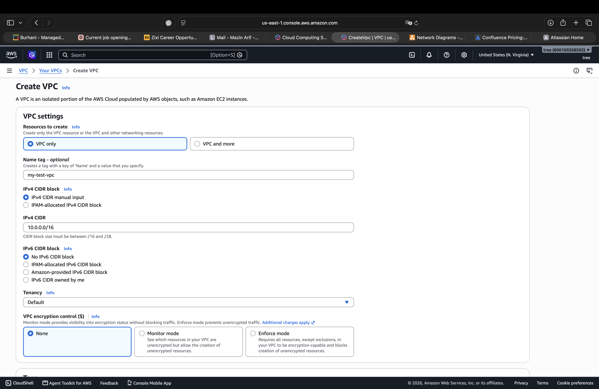
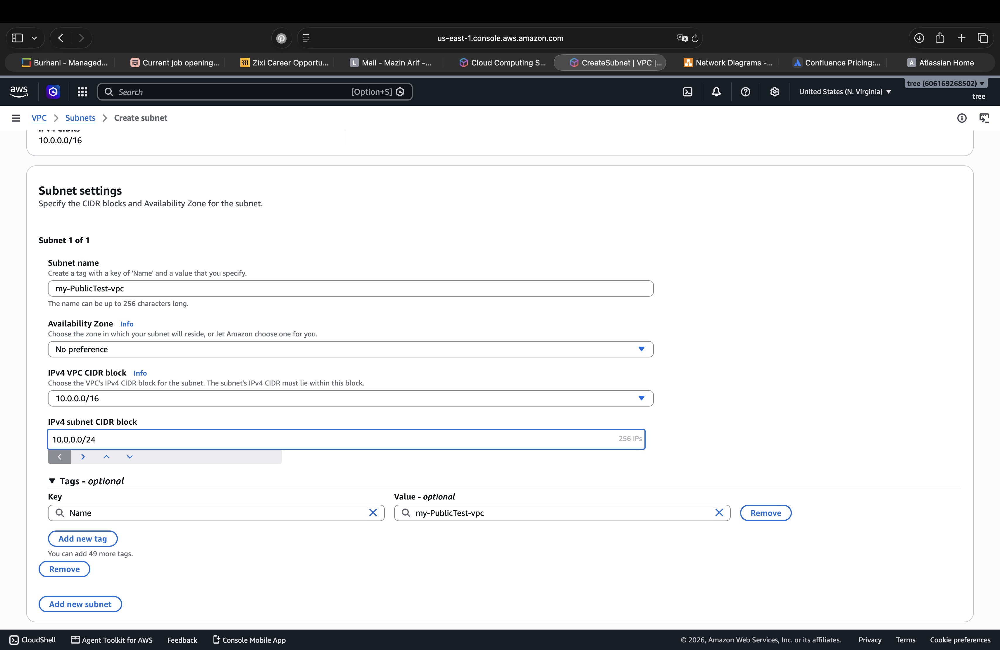
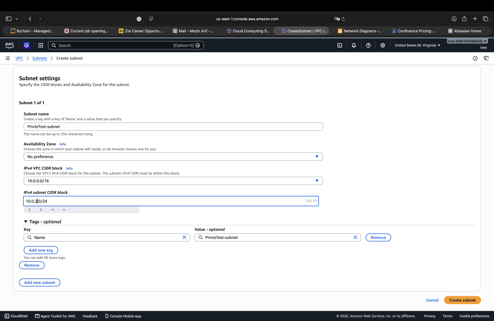
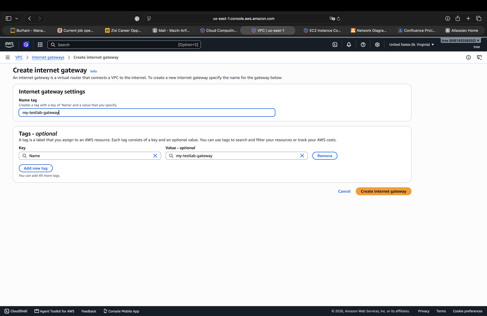
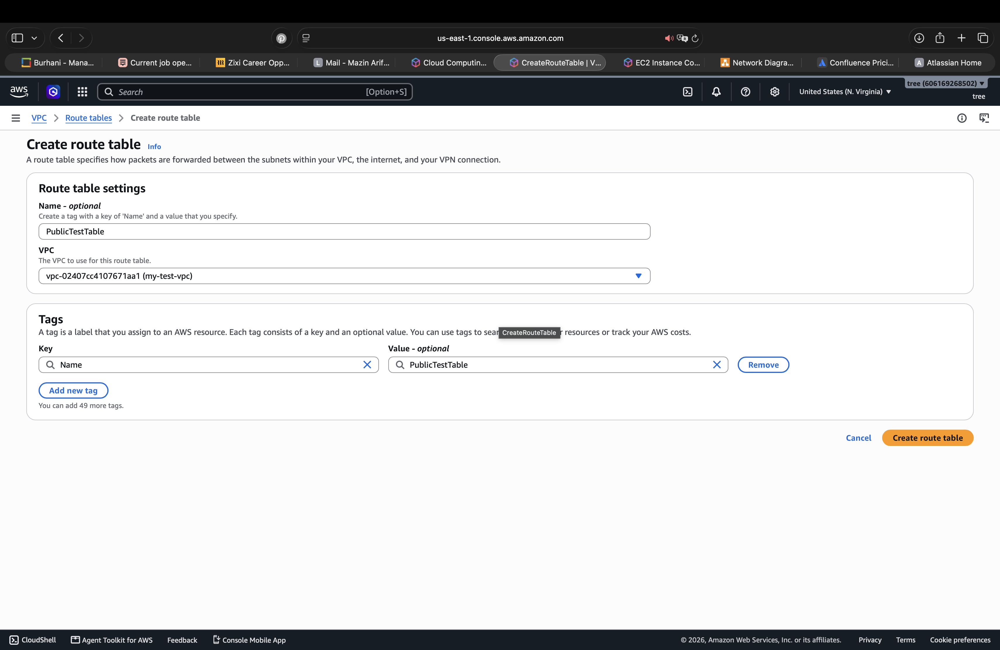
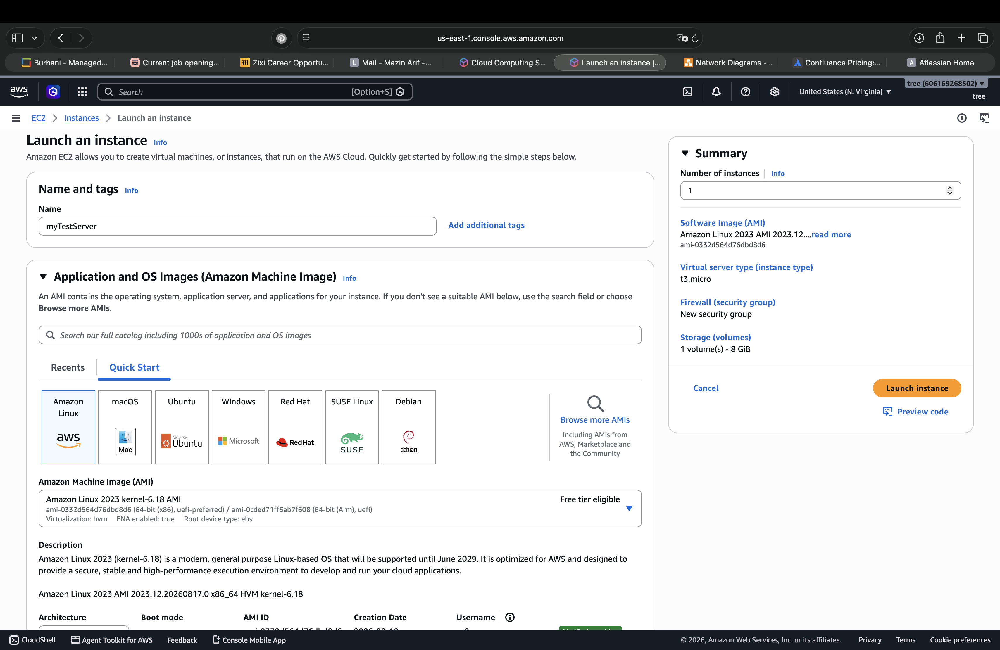
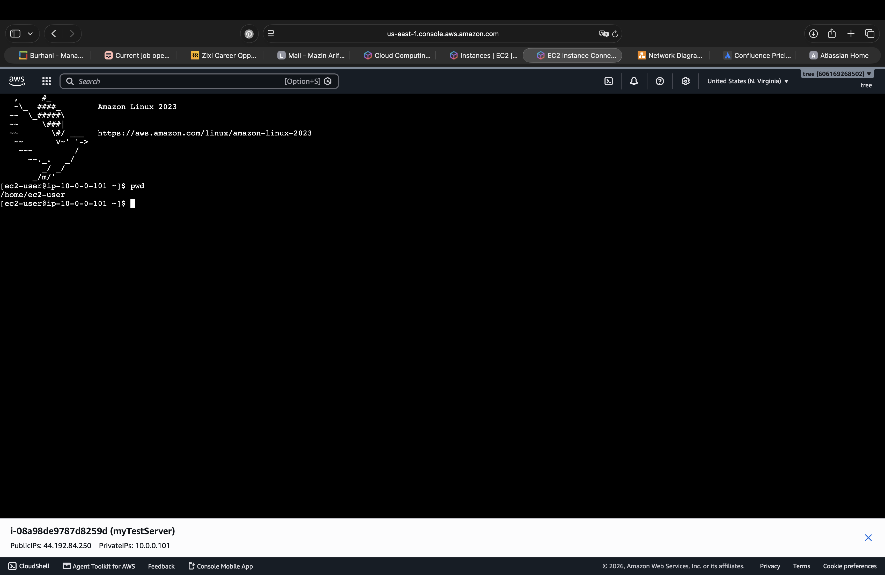
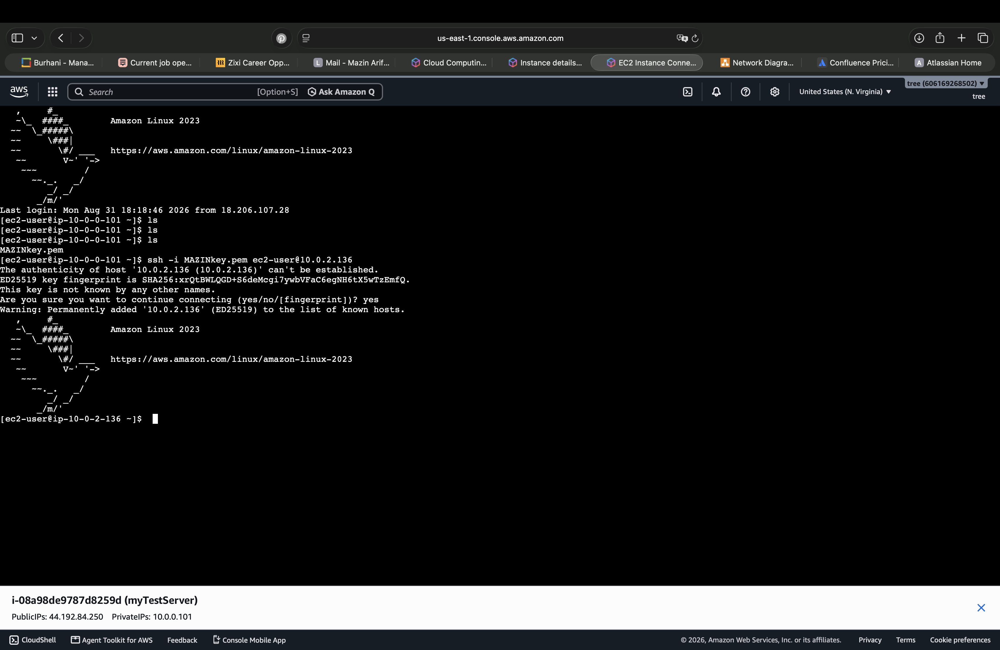
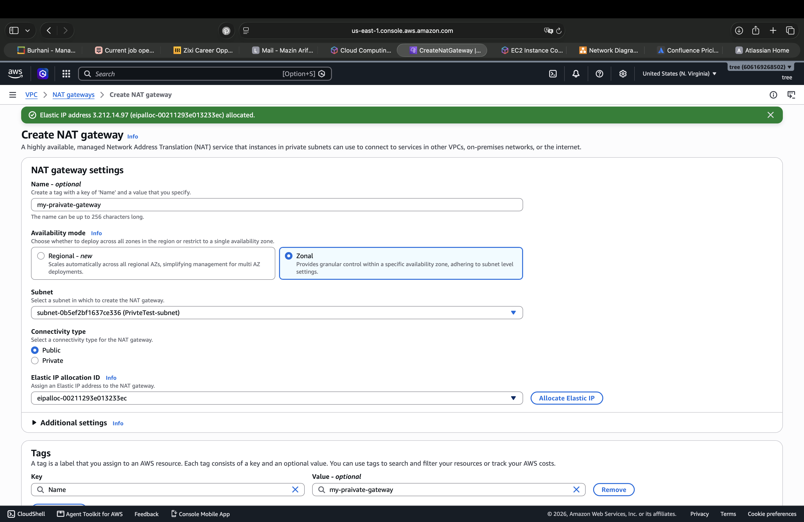

# 🌐 AWS VPC — Public & Private Network Lab

## 📌 Overview

This lab demonstrates the creation and configuration of a custom **Amazon Virtual Private Cloud (VPC)** with separate public and private subnets.

The lab covers core AWS networking components including **VPCs, subnets, route tables, Internet Gateway, NAT Gateway, EC2 networking, and SSH communication between instances**.

The environment was built to understand how resources communicate within a VPC and how public and private network configurations differ.

---

## 🎯 Objective

The objectives of this lab are to:

* Create a custom VPC using an IPv4 CIDR block.
* Create separate public and private subnets.
* Configure an Internet Gateway for Internet connectivity.
* Create and configure a public route table.
* Deploy an EC2 instance inside the public subnet.
* Deploy an EC2 instance inside the private subnet.
* Establish SSH access to the public EC2 instance.
* Establish SSH communication between the public and private EC2 instances.
* Configure a NAT Gateway as part of the private network connectivity setup.

---

## 🏗️ Network Architecture

The lab was built using the following network structure:

```text
                         Internet
                            │
                            ▼
                    Internet Gateway
                            │
                     Public Subnet
                      10.0.0.0/24
                            │
                     Public EC2
                    10.0.0.101
                            │
                            │ SSH
                            ▼
                     Private Subnet
                      10.0.2.0/24
                            │
                     Private EC2
                    10.0.2.136
```

The VPC uses:

```text
VPC CIDR: 10.0.0.0/16
```

---

## ⚙️ Configuration

### 1. Create the VPC

A custom VPC named `my-test-vpc` was created with the IPv4 CIDR block:

```text
10.0.0.0/16
```

This address range provides the private IP space used by the subnets and resources in the lab.



---

### 2. Create the Public Subnet

A public subnet named `PublicTest-subnet` was created inside the VPC.

Configuration:

```text
Subnet: PublicTest-subnet
CIDR: 10.0.0.0/24
```



---

### 3. Create the Private Subnet

A separate private subnet named `PrivteTest-subnet` was created.

Configuration:

```text
Subnet: PrivteTest-subnet
CIDR: 10.0.2.0/24
```



The separation between public and private subnets allows different routing and access behavior to be applied to the resources placed inside them.

---

### 4. Create the Internet Gateway

An Internet Gateway named `my-testlab-gateway` was created for the VPC.

An Internet Gateway provides a connection between the VPC and the Internet when the appropriate routing and public addressing are configured.



---

### 5. Create the Public Route Table

A route table named `PublicTestTable` was created and associated with the VPC.



The public subnet was associated with this route table so that its traffic could follow the public Internet route.

---

### 6. Configure the Public Route

The public route table was configured with the following route:

```text
Destination: 0.0.0.0/0
Target: Internet Gateway
```

This route provides a default path from the public subnet toward the Internet Gateway.


---

## 💻 EC2 Deployment

### 7. Launch the Public EC2 Instance

An Amazon Linux 2023 EC2 instance named `myTestServer` was deployed inside the public subnet.

Configuration:

```text
AMI: Amazon Linux 2023
Instance Type: t3.micro
Subnet: PublicTest-subnet
Private IP: 10.0.0.101
```



The instance was configured to allow SSH access through its Security Group.

---

### 8. Connect to the Public EC2 Instance

The public EC2 instance was accessed remotely using SSH.

The SSH session was used to perform basic Linux administration and network-related tasks.



---

### 9. Connect to the Private EC2 Instance

A second Amazon Linux 2023 EC2 instance was deployed inside the private subnet.

The private instance used the private IP address:

```text
10.0.2.136
```

The public EC2 instance was then used as the access point to establish an SSH connection to the private EC2 instance using its private IP address.

```text
Public EC2
     ↓
SSH
     ↓
Private EC2
```



This demonstrated communication between EC2 instances inside the VPC using private networking.

---

## 🌐 NAT Gateway

A NAT Gateway was created as part of the network configuration for private resources.



The purpose of a NAT Gateway is to provide a controlled path for resources in private subnets to initiate outbound connections to external networks without requiring those resources to have public IP addresses.

---

## 🧪 Testing & Verification

The following activities were performed during the lab:

* Verified that the custom VPC was created with the expected CIDR block.
* Verified the creation of both public and private subnets.
* Configured an Internet Gateway for the VPC.
* Created and configured a public route table.
* Deployed an EC2 instance in the public subnet.
* Established SSH access to the public EC2 instance.
* Deployed a second EC2 instance in the private subnet.
* Established SSH communication from the public EC2 instance to the private EC2 instance using its private IP address.
* Created a NAT Gateway as part of the private network connectivity configuration.

---

## 🔐 Security Considerations

This lab demonstrates an important security principle in cloud networking: **public and private resources should be separated based on their access requirements**.

The private EC2 instance was deployed without relying on a public IP address and was accessed through the public EC2 instance using private networking.

Security Groups were used to control inbound traffic to the EC2 instances.

For production environments:

* SSH access should be restricted to trusted source IP addresses.
* Private resources should remain in private subnets when direct Internet access is unnecessary.
* Security Group rules should follow the principle of least privilege.
* NAT Gateway and other network resources should be reviewed and removed when no longer required.

---

## 🧠 Key Concepts Learned

This lab provided hands-on experience with:

* Amazon VPC
* IPv4 CIDR blocks
* Public and private subnets
* Route tables
* Default routes
* Internet Gateway
* NAT Gateway
* Public and private IP addresses
* EC2 networking
* Security Groups
* SSH
* Private communication between EC2 instances

---

## 🔎 Key Findings

The lab demonstrated how AWS networking components work together:

```text
VPC
 ↓
Subnets
 ↓
Route Tables
 ↓
Internet Gateway / NAT Gateway
 ↓
EC2 Connectivity
```

It also demonstrated the difference between accessing a resource through a **public network path** and communicating with a resource through its **private IP address inside the VPC**.

---

## 📝 Lessons Learned

The main lessons from this lab were:

* A VPC provides an isolated virtual network for AWS resources.
* Subnets divide a VPC into smaller network segments.
* Route tables determine how network traffic is forwarded.
* An Internet Gateway provides Internet connectivity for appropriately configured public resources.
* Private EC2 instances can communicate with other resources inside the VPC using private IP addresses.
* NAT Gateway is used to provide outbound connectivity for private resources without assigning them public IP addresses.
* Public and private network segmentation is an important foundation for secure AWS architectures.

---

## 🧹 Cleanup

After completing the lab, AWS resources should be removed when they are no longer required to avoid unnecessary charges.

Recommended cleanup:

```text
Terminate EC2 Instances
        ↓
Delete NAT Gateway
        ↓
Delete Route Tables
        ↓
Detach Internet Gateway
        ↓
Delete Subnets
        ↓
Delete VPC
```

---

## ✅ Result

A custom AWS VPC environment was successfully created and tested with **public and private subnets, routing, Internet connectivity, EC2 instances, SSH access, and NAT Gateway configuration**.

The lab provided practical experience with the fundamental networking components required to build and secure AWS cloud infrastructure.
