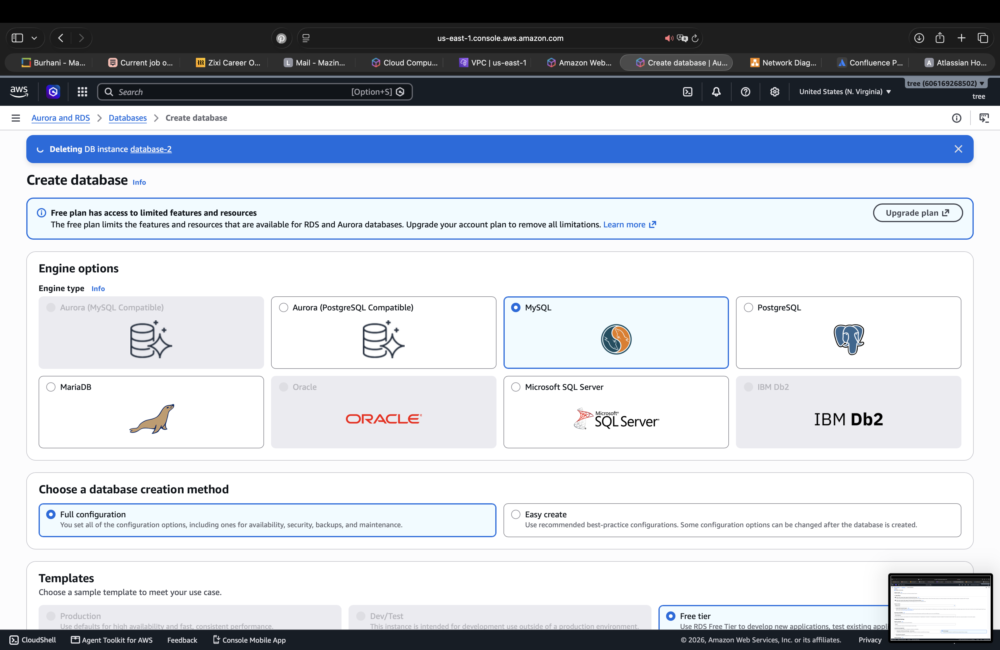
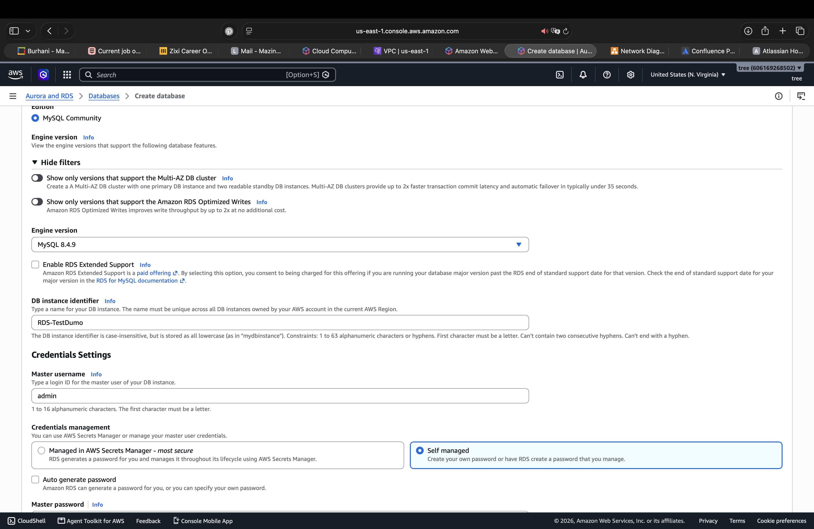
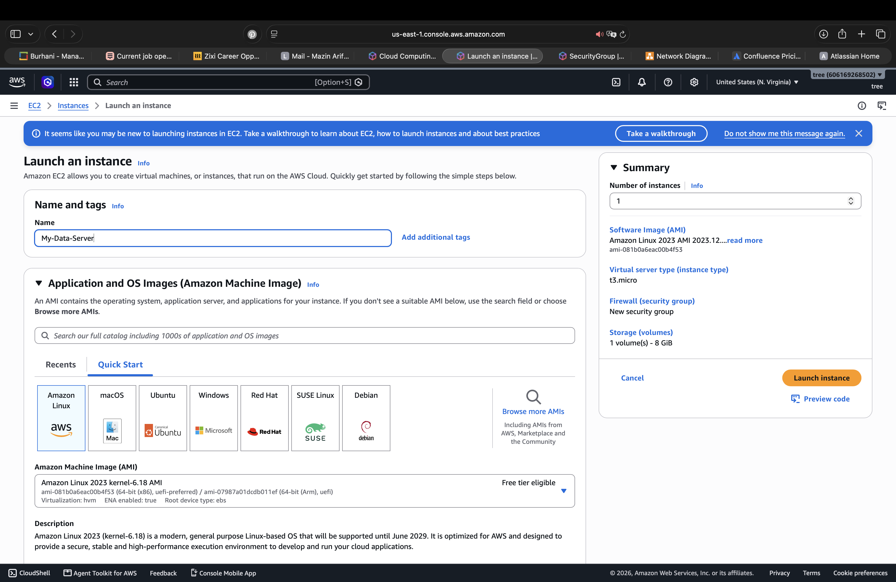
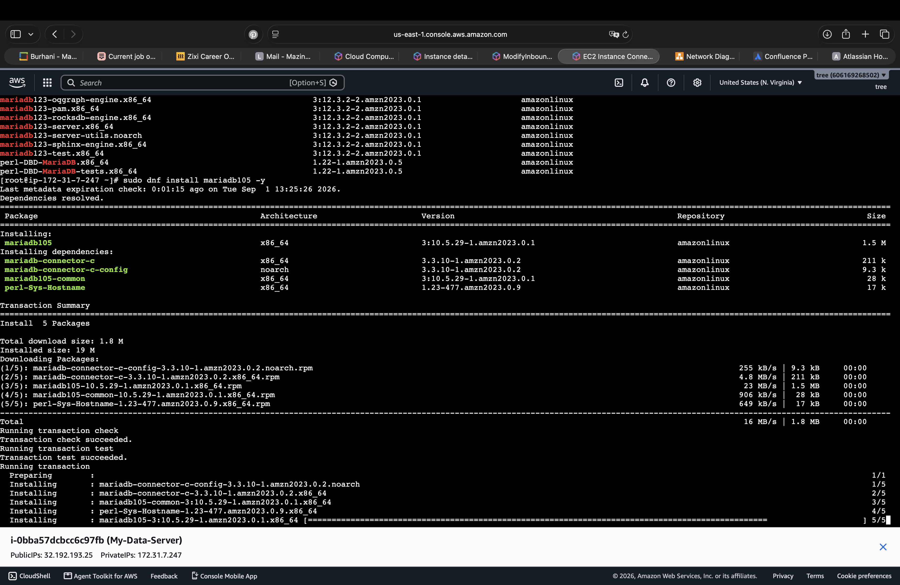
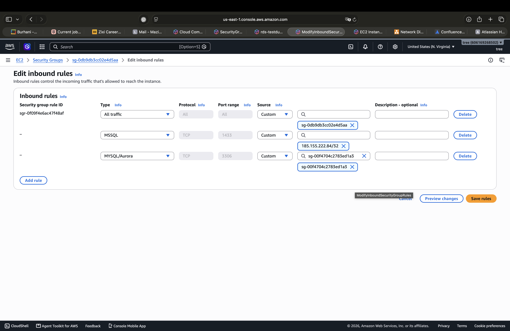
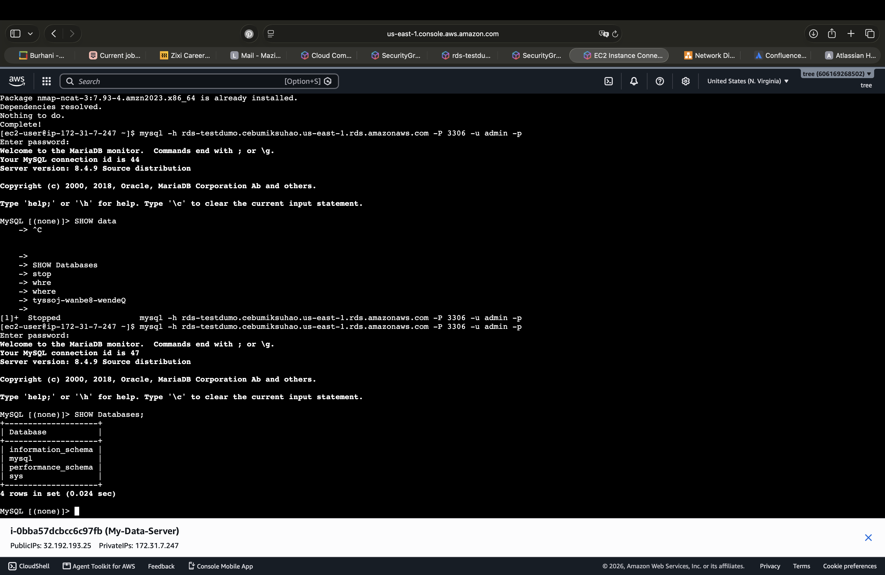

# ☁️ AWS RDS MySQL — EC2 to RDS Connection

## 📌 Scenario

A MySQL database was deployed using Amazon RDS. An Amazon EC2 instance running Amazon Linux 2023 was configured as the client machine to connect to the RDS database through TCP port `3306`.

---

## 🗄️ Create the RDS MySQL Database

The RDS database was created using the MySQL engine with MySQL 8.4.9. The database identifier is `RDS-TestDumo` and the master username is `admin`.



---

## ⚙️ Configure the RDS Engine

MySQL was selected as the database engine, using the full configuration option and the Free Tier template for the lab.



---

## 💻 Launch the EC2 Instance

An EC2 instance named `My-Data-Server` was launched using Amazon Linux 2023 with the `t3.micro` instance type.



---

## 🛠️ Install the MySQL Client

The MariaDB/MySQL-compatible client was installed on the EC2 instance using:

```bash
sudo dnf install mariadb105 -y
```



The installation completed successfully.

The database server itself is not running on EC2. The database is hosted by Amazon RDS.

---

## 🔐 Configure the Security Group

The Security Group was configured to allow MySQL/Aurora traffic on TCP port `3306` from the EC2 Security Group.



### Rule

```text
Type: MySQL/Aurora
Protocol: TCP
Port: 3306
Source: EC2 Security Group
```

This allows the EC2 instance to communicate with the RDS database.

---

## 📡 Test RDS Connectivity

The connection between the EC2 instance and the RDS database was tested using `nc`.

```bash
nc -vz rds-testdumo.cebumiksuhao.us-east-1.rds.amazonaws.com 3306
```

The connection successfully reached the RDS endpoint on port `3306`.


## 🗃️ Connect to RDS MySQL

After confirming network connectivity, I connected to the RDS database using the MySQL-compatible client.

```bash
mysql -h rds-testdumo.cebumiksuhao.us-east-1.rds.amazonaws.com -P 3306 -u admin -p
```

The MySQL session was successfully established.



---

## 🔎 Verify Database Access

After connecting to RDS, I executed the following SQL command:

```sql
SHOW DATABASES;
```

The RDS MySQL server returned the available databases:

```text
+--------------------+
| Database           |
+--------------------+
| information_schema |
| mysql              |
| performance_schema |
| sys                |
+--------------------+
```


This confirms that the EC2 instance successfully connected to the MySQL database running on RDS and was able to execute SQL commands.

---

## 🧠 Findings

- RDS successfully hosted the MySQL database.
- EC2 successfully acted as the database client.
- TCP port `3306` was configured for MySQL communication.
- The Security Group allowed the required traffic.
- The MySQL client successfully connected to RDS.
- SQL queries were successfully executed.

---

## 🚨 Conclusion

The lab successfully demonstrated an **EC2-to-RDS MySQL connection**.

The final communication path was:

```text
EC2
 │
 │ TCP 3306
 ▼
RDS MySQL
```

The EC2 instance successfully reached the RDS endpoint, authenticated with the database credentials, and executed SQL queries.

---

## 🟢 Status

**Completed successfully ✅**

---

## 🛠️ Tools Used

- AWS RDS
- AWS EC2
- AWS Security Groups
- Amazon Linux 2023
- MariaDB/MySQL Client
- Ncat
- MySQL CLI
