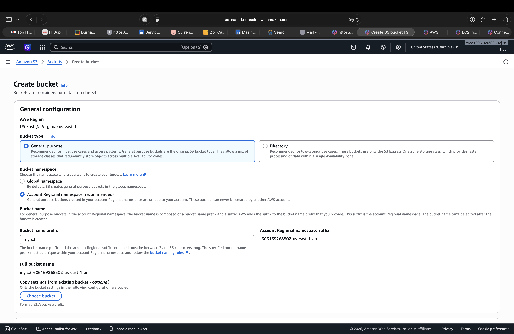
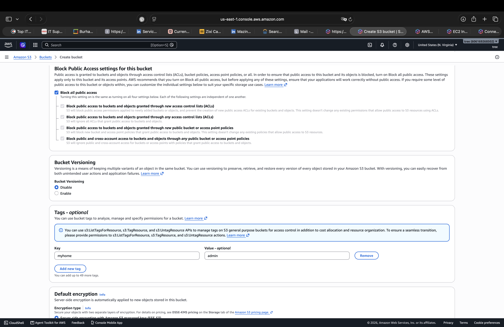
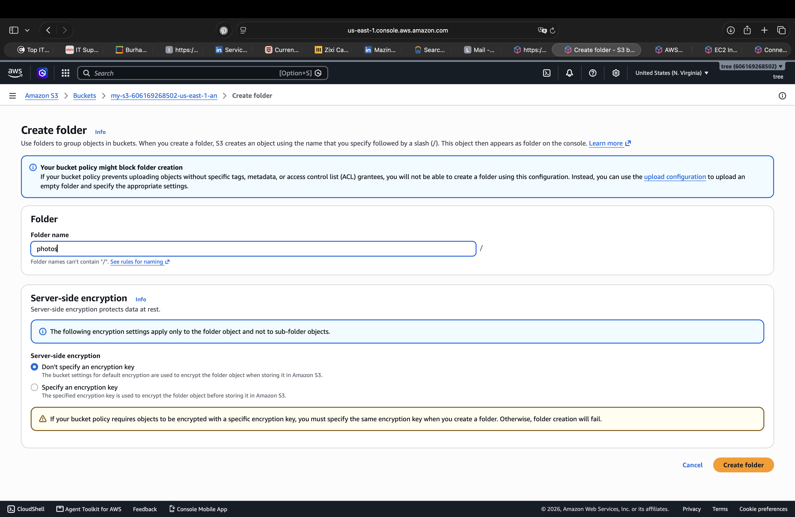
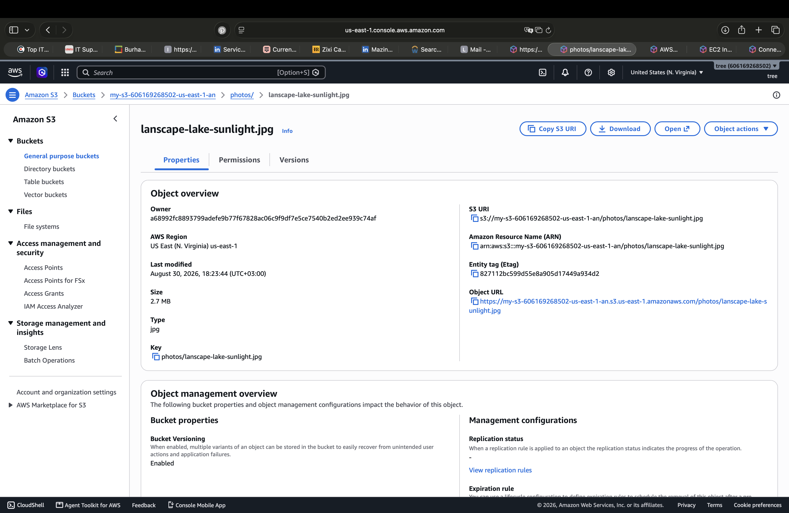

# 🗄️ AWS S3 — Bucket & Object Management

## 📌 Overview

This lab demonstrates the creation and basic management of an **Amazon S3 bucket** and its objects.

The lab covers bucket configuration, public access protection, versioning, tagging, folder creation, and uploading an object to Amazon S3.

---

## 🎯 Objective

The objectives of this lab are to:

* Create an Amazon S3 bucket.
* Configure the bucket region and namespace.
* Configure Block Public Access settings.
* Enable S3 Bucket Versioning.
* Add tags to the bucket.
* Create a folder within the bucket.
* Upload an object to Amazon S3.
* Verify the uploaded object's properties and S3 resource information.

---

## ⚙️ Configuration

### 1. Create S3 Bucket

An S3 bucket was created using the following configuration:

* **Service:** Amazon S3
* **Bucket Type:** General purpose
* **Region:** US East (N. Virginia) — `us-east-1`
* **Bucket Namespace:** Account Regional Namespace
* **Bucket Name Prefix:** `my-s3`



The bucket provides the storage location for the objects used in this lab.

---

### 2. Configure Bucket Security & Versioning

The bucket was configured with the following settings:

* **Block Public Access:** Enabled
* **Bucket Versioning:** Enabled
* **Tag:** `myhome: admin`
* **Server-side encryption:** Configured using the bucket's encryption settings



Blocking public access helps prevent unintended public access to the bucket and its objects.

Versioning allows multiple versions of an object to be maintained within the bucket.

---

### 3. Create S3 Folder

A folder named `photos` was created inside the S3 bucket.



The folder provides a logical structure for organizing objects stored in the bucket.

The resulting object path used in this lab is:

```text
photos/
```

---

### 4. Upload Object to S3

An image named `landscape-lake-sunlight.jpg` was uploaded into the `photos` folder.

The object was successfully stored in Amazon S3.



The uploaded object was verified through its properties, including:

- **Object Name:** `landscape-lake-sunlight.jpg`
- **Object Key:** `photos/landscape-lake-sunlight.jpg`
- **Type:** `jpg`
- **Size:** `2.7 MB`
- **Region:** US East (N. Virginia) — `us-east-1`
- **Versioning:** Enabled
- **S3 URI:** Available from the object properties
- **ARN:** Available from the object properties
- **Object URL:** Available from the object properties

---

## 🔐 Security Considerations

The S3 bucket was configured with **Block Public Access enabled**, providing protection against accidental public exposure.

The lab also demonstrates the importance of understanding:

- Bucket-level access controls
- Object-level access
- Public access prevention
- Versioning
- Server-side encryption
- S3 resource identifiers such as S3 URIs and ARNs

For production environments, S3 permissions should follow the **principle of least privilege**, with access granted only to the users, roles, and services that require it.

---

## 🧪 Testing & Verification

The following checks were performed:

1. Verified that the S3 bucket was created successfully.
2. Verified that Block Public Access was enabled.
3. Verified that Bucket Versioning was enabled.
4. Created the `photos` folder successfully.
5. Uploaded `landscape-lake-sunlight.jpg`.
6. Opened the object's properties and verified its metadata.
7. Confirmed the object's S3 URI, ARN, and Object URL.

---

## 📝 Key Findings

This lab provided practical experience with the basic components of Amazon S3:

```text
S3 Bucket
    ↓
Folder / Prefix
    ↓
Object
    ↓
Object Properties
    ↓
S3 URI / ARN / Object URL
```

The lab also demonstrated how security and management settings such as **Block Public Access, Versioning, Tags, and Encryption** are configured at the S3 bucket level.

---

## 📚 Skills Practiced

- Amazon S3
- S3 Bucket Management
- S3 Object Management
- Bucket Versioning
- Block Public Access
- Server-side Encryption
- S3 Folder / Prefix Organization
- S3 URI
- Amazon Resource Name (ARN)
- Object URL
- Basic AWS Storage Administration
