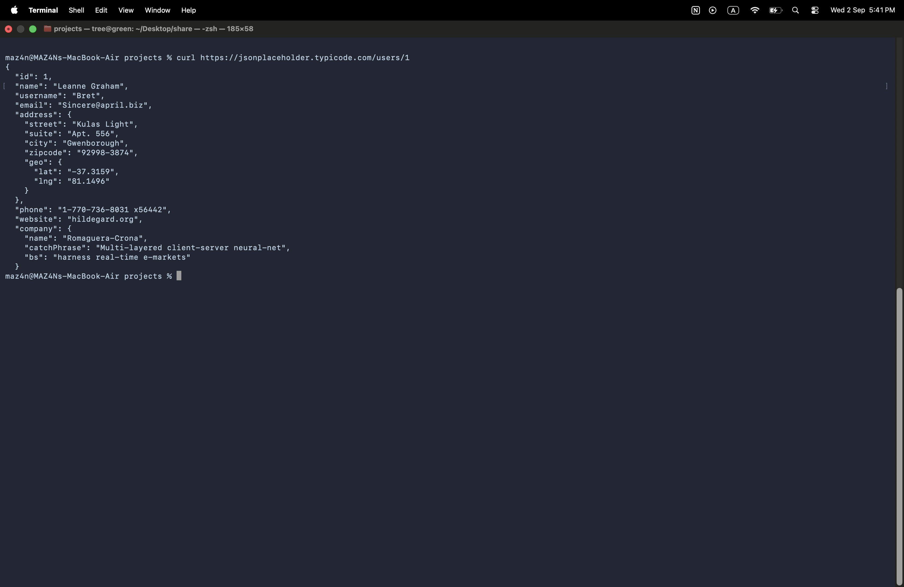
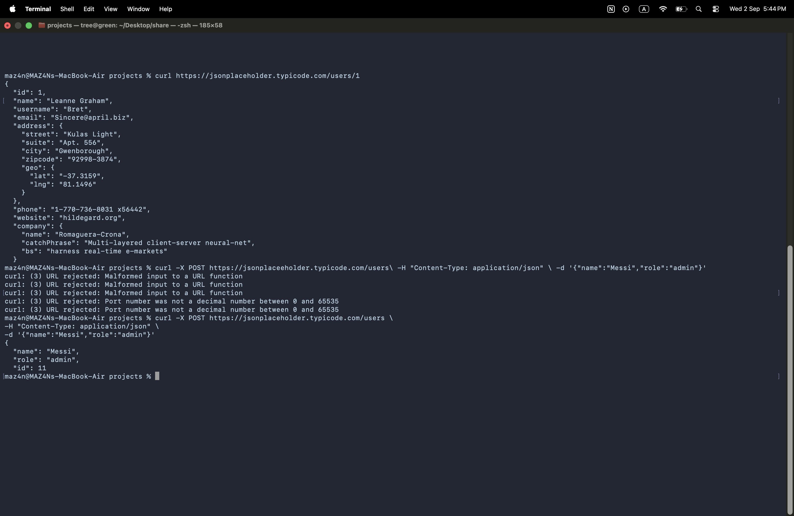
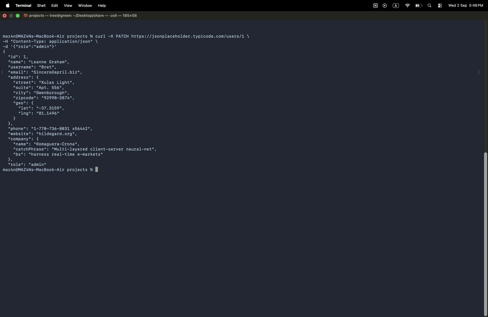
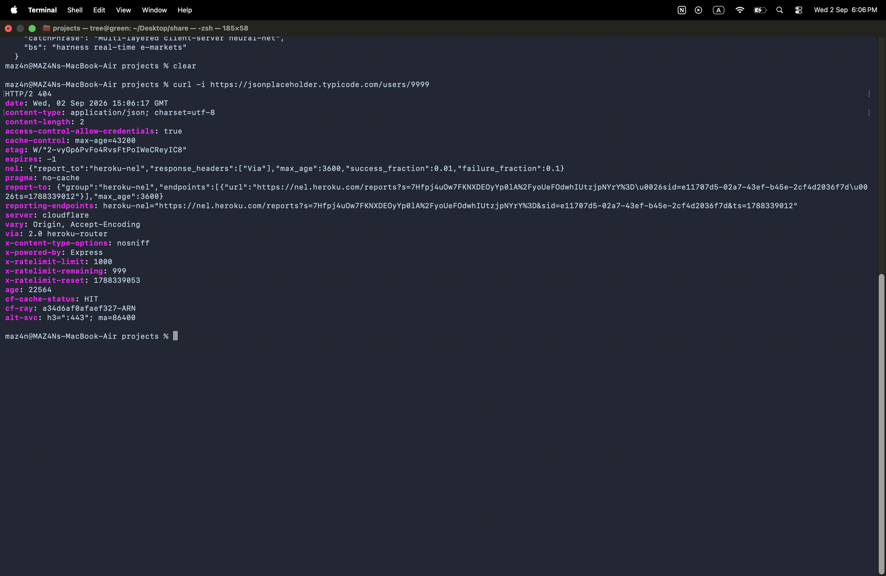
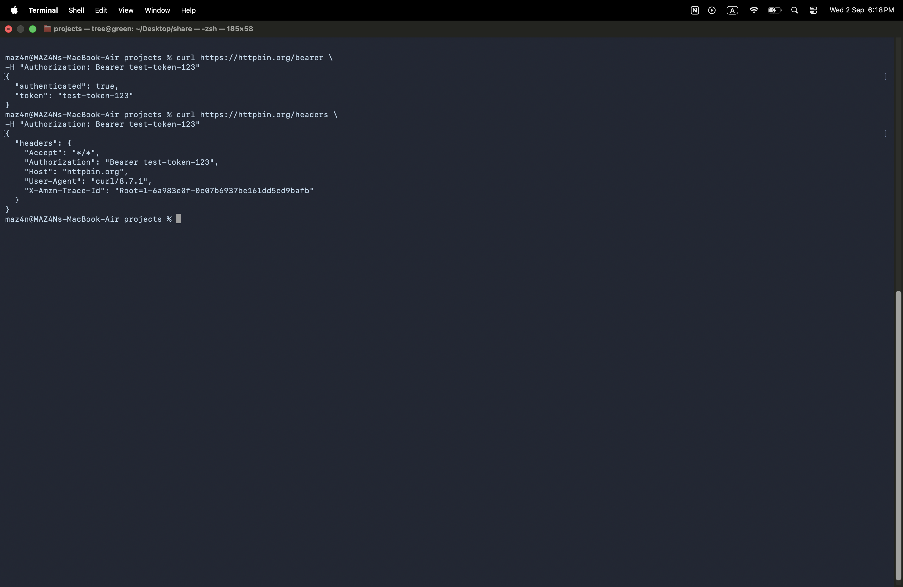

# 🔌 API Fundamentals & REST

## 📌 Overview

Hands-on API lab focused on understanding how clients communicate with web APIs using HTTP requests and responses.

The lab covered REST APIs, HTTP methods, JSON, status codes, headers, authentication basics, and using `curl` from the macOS Terminal.

---

# 1. 🌐 GET Request

Used `curl` to send a GET request to a REST API endpoint and retrieve user data.

```bash
curl https://jsonplaceholder.typicode.com/users/1
```



The API returned user information in JSON format.

This demonstrates the basic flow:

```text
Client → HTTP Request → API → JSON Response
```

---

# 2. 📤 POST Request

Used `POST` to send JSON data to the API.

```bash
curl -X POST https://jsonplaceholder.typicode.com/users \
-H "Content-Type: application/json" \
-d '{"name":"Messi","role":"admin"}'
```



The API returned the submitted data with an assigned `id`.

This demonstrates how clients can send data to an API.

---

# 3. 🔄 PUT & PATCH

Practiced updating API resources using `PUT` and `PATCH`.

### PUT

`PUT` is generally used to replace or update a resource.

```bash
curl -X PUT https://jsonplaceholder.typicode.com/users/1 \
-H "Content-Type: application/json" \
-d '{"name":"Messi Updated","role":"user"}'
```

### PATCH

`PATCH` is generally used to modify part of a resource.

```bash
curl -X PATCH https://jsonplaceholder.typicode.com/users/1 \
-H "Content-Type: application/json" \
-d '{"role":"admin"}'
```



The PATCH request modified only the specified field.

---

# 4. 🗑️ DELETE

Practiced deleting an API resource using the `DELETE` HTTP method.

```bash
curl -X DELETE https://jsonplaceholder.typicode.com/users/1
```

`DELETE` is used to request removal of a resource from an API.

---

# 5. 📊 HTTP Status Codes

Used `curl -i` to inspect HTTP response status codes and headers.

A successful request returned:

```text
HTTP/2 200
```

A request for a non-existent resource returned:

```text
HTTP/2 404
```

```bash
curl -i https://jsonplaceholder.typicode.com/users/9999
```



`404 Not Found` indicates that the server received the request but the requested resource was not found.

Key status codes reviewed:

| Status Code | Meaning |
|---|---|
| `200` | OK |
| `201` | Created |
| `400` | Bad Request |
| `401` | Unauthorized |
| `403` | Forbidden |
| `404` | Not Found |
| `500` | Internal Server Error |

---

# 6. 📦 JSON & HTTP Headers

API responses commonly use JSON to represent structured data.

Example:

```json
{
  "id": 1,
  "name": "Leanne Graham",
  "username": "Bret"
}
```

HTTP headers provide additional information about a request or response.

For example:

```text
Content-Type: application/json
```

indicates that the content is JSON.

---

# 7. 🔐 Bearer Token Authentication

Practiced sending a Bearer Token through the HTTP `Authorization` header using `curl`.

```bash
curl https://httpbin.org/bearer \
-H "Authorization: Bearer test-token-123"
```



The API returned:

```json
{
  "authenticated": true,
  "token": "test-token-123"
}
```

This demonstrated how authentication information can be included in an HTTP request.

The token used in this lab was a test value and not a real credential.

---

# 8. 🧾 Inspecting HTTP Headers

Used the `httpbin` `/headers` endpoint to observe the headers sent by the client.

```bash
curl https://httpbin.org/headers \
-H "Authorization: Bearer test-token-123"
```

The response showed the `Authorization` header received by the server.

```text
Authorization: Bearer test-token-123
```

This demonstrates where authentication information can be transmitted within an HTTP request.

---

# 🧠 Authentication vs Authorization

### Authentication

Answers:

> Who are you?

Examples include:

- API Keys
- Bearer Tokens
- Basic Authentication

### Authorization

Answers:

> What are you allowed to do?

For example:

```text
Authenticated User
       ↓
Can access /users       ✅
Can delete users        ❌
```

Authentication and authorization are separate concepts and are both important in API security.

---

# 🛠️ Tools Used

- macOS Terminal
- `curl`
- REST APIs
- JSONPlaceholder
- httpbin.org
- HTTP

---

# 🧠 Skills Practiced

- REST API fundamentals
- HTTP methods
- GET / POST / PUT / PATCH / DELETE
- JSON
- HTTP status codes
- HTTP headers
- API authentication basics
- Bearer tokens
- `curl`
- Client-server communication

---

# 🎯 What I Learned

This lab provided practical experience interacting with REST APIs from the command line.

I learned how HTTP requests are structured, how APIs return JSON responses, how HTTP methods perform different operations, how status codes communicate request results, and how authentication information can be passed through HTTP headers.

These concepts provide a foundation for working with AWS APIs, automation, DevSecOps, and API security.