# 🐧 Linux System Administration

## 📌 Overview

Hands-on Linux system administration lab covering essential skills used in Cloud Engineering and Cloud Security.

The lab focuses on:

- Command Line Interface (CLI)
- File Management
- File Permissions
- Users & Groups
- Process Management
- Services
- System Logs
- SSH
- Basic Network Troubleshooting

---

# 1. 🖥 CLI & File Management

Practiced basic Linux navigation and file management using the command line.

Commands used included:

- `mkdir`
- `cd`
- `touch`
- `echo`
- `cat`
- `cp`
- `mv`
- `ls`

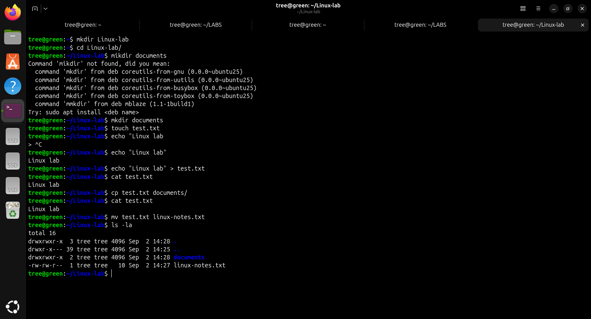

This demonstrates basic filesystem navigation and file manipulation from the Linux CLI.

---

# 2. 🔐 File Permissions

Practiced modifying Linux file permissions using `chmod`.

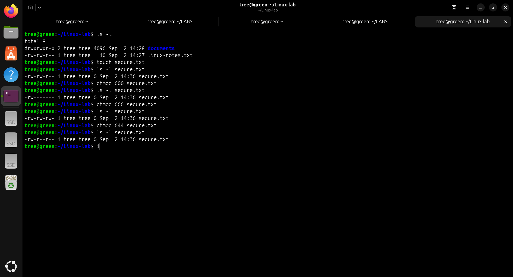

Linux permissions control who can read, write, or execute files.

---

# 3. 👤 Users & Groups

Created a Linux user and group, then added the user to the group.

Commands used included:

- `useradd`
- `passwd`
- `groupadd`
- `usermod -aG`
- `groups`
- `id`

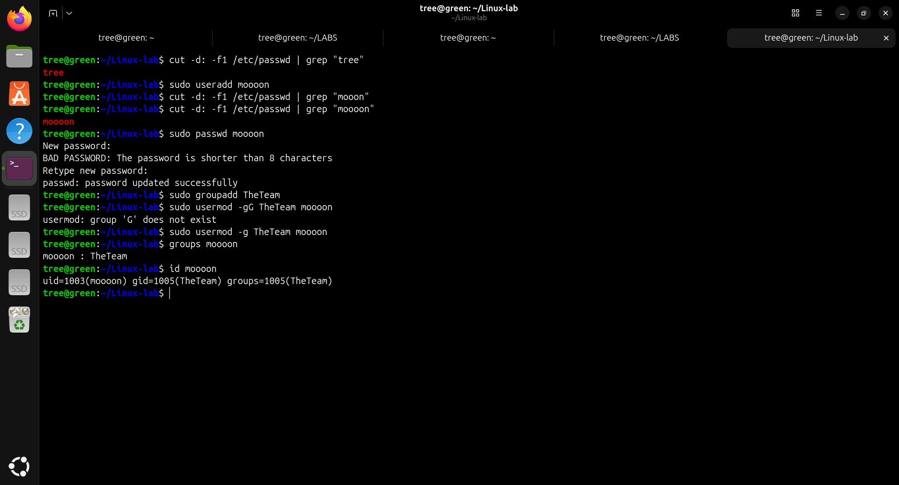

The lab user `moooon` was added to the `TheTeam` group and verified using `groups` and `id`.

---

# 4. ⚙️ Process Management

Inspected running processes using `ps`.

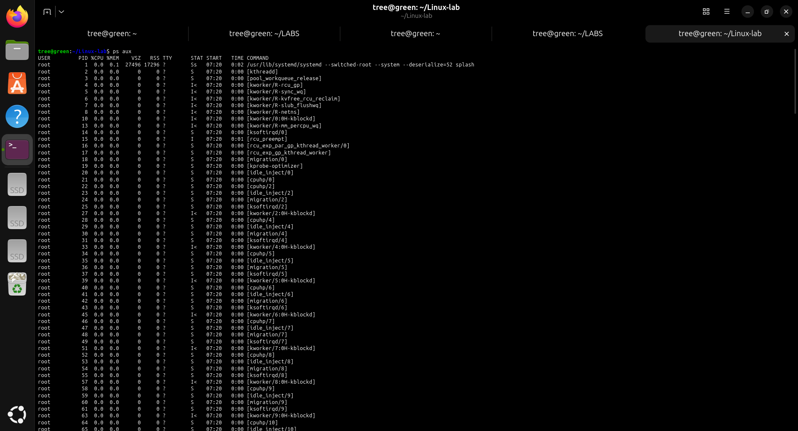

`ps aux` provides information about currently running processes and their associated users and resource information.

---

# 5. 📊 Process Monitoring

Used `htop` to monitor running processes interactively.

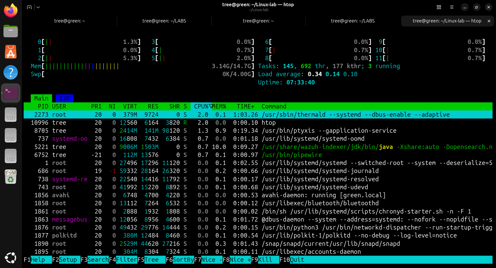

This provides a real-time view of system processes and resource usage.

---

# 6. 🌐 SSH Processes & Network Information

Inspected SSH-related processes and network interface information.

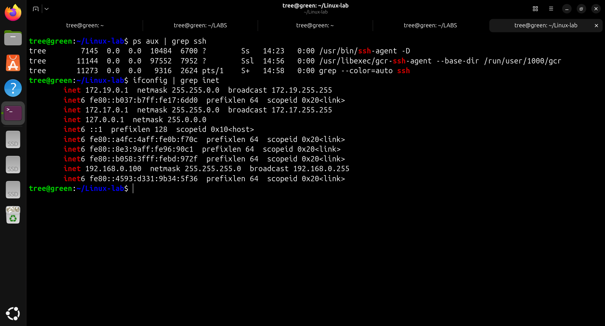

This helped verify running SSH processes and identify the system's network information.

---

# 7. 🔧 SSH Service Management

Managed the SSH service using `systemctl`.

Commands used:

```bash
systemctl restart ssh
systemctl status ssh
systemctl stop ssh
```

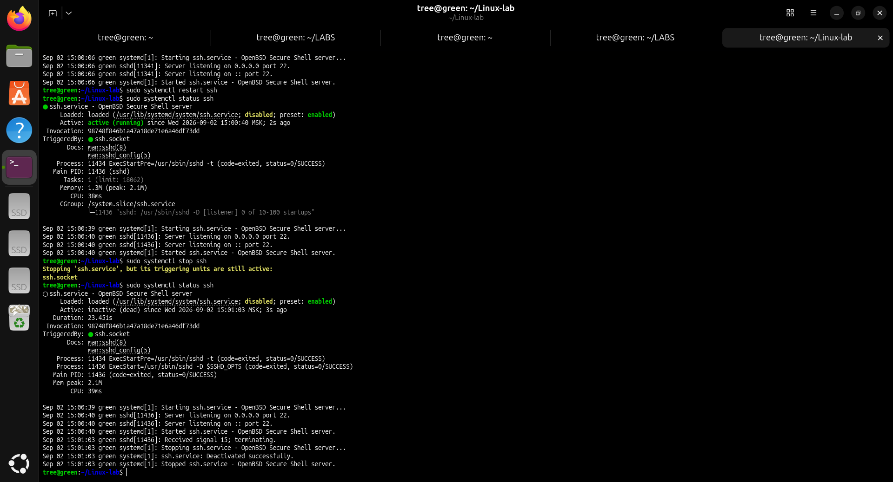

This demonstrates basic Linux service management using `systemctl`.

---

# 8. 📜 System Logs

Inspected system logs using `journalctl`.

Commands used:

```bash
journalctl -n 20
journalctl -b
```

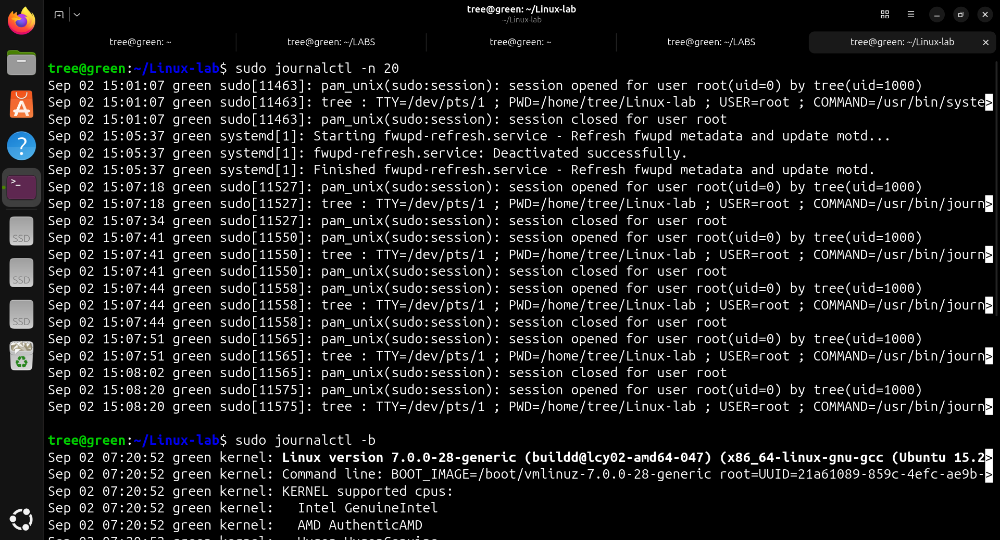

`journalctl` provides access to logs collected by the systemd journal, which is useful for troubleshooting and system investigation.

---

# 9. 📁 Linux Log Directory

Inspected the `/var/log/` directory.

```bash
ls /var/log/
```

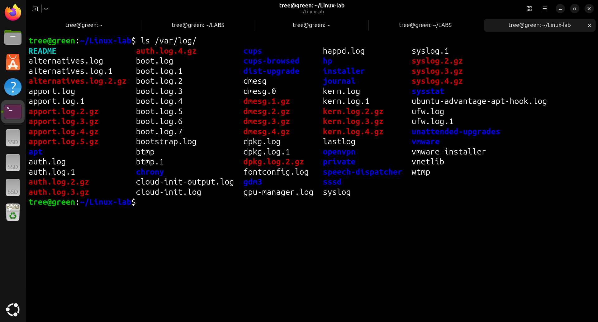

The `/var/log/` directory contains system and application log files used for troubleshooting and monitoring.

---

# 10. 🌐 Basic Network Troubleshooting

Tested network connectivity and DNS resolution.

Commands used:

```bash
ping 8.8.8.8
nslookup google.com
```

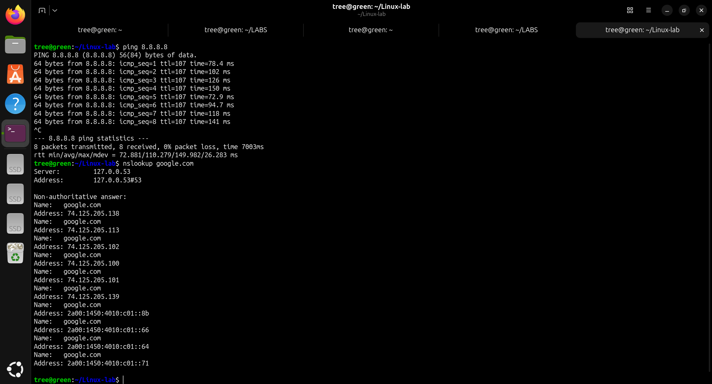

`ping` was used to test network reachability, while `nslookup` was used to verify DNS resolution.

---

# 11. 🔑 Remote SSH Connection

Connected remotely from the MacBook to the Ubuntu system using SSH.

```bash
ssh tree@192.168.0.100
```

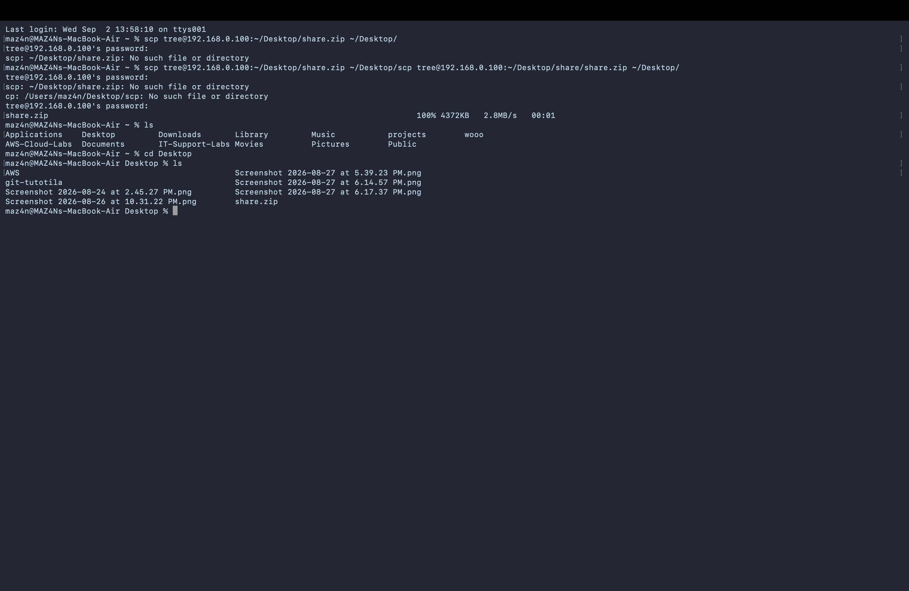

The successful login demonstrates remote administration of a Linux system over SSH.

---

# 🧠 Skills Practiced

- Linux CLI
- File and directory management
- Linux permissions
- User and group administration
- Process management
- Process monitoring
- Linux service management
- System log investigation
- SSH administration
- Basic network troubleshooting
- DNS troubleshooting

---

# 🎯 What I Learned

This lab provided practical experience with core Linux administration tasks required for cloud environments.

I practiced managing users, permissions, processes, services, logs, remote access, and basic network troubleshooting directly from the Linux command line.

These skills form a foundation for further work with cloud infrastructure, automation, networking, and cloud security.