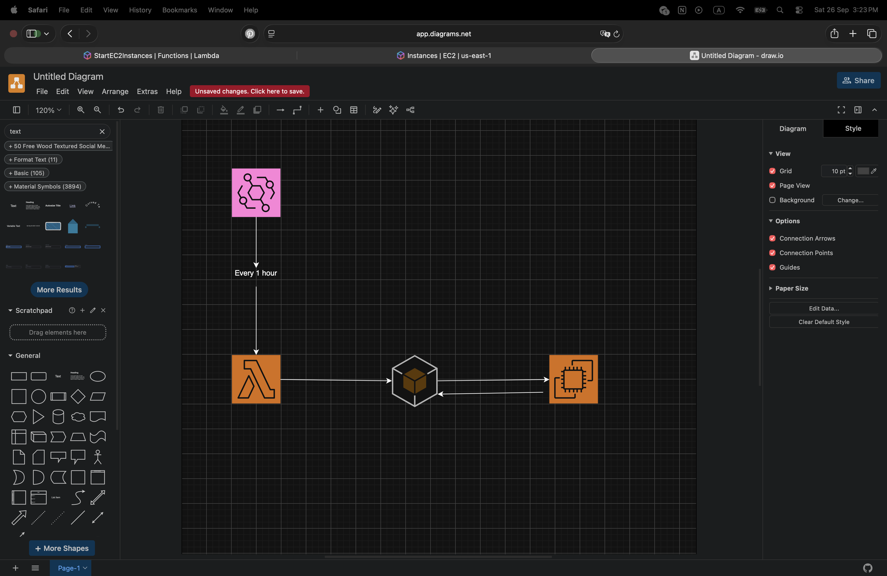
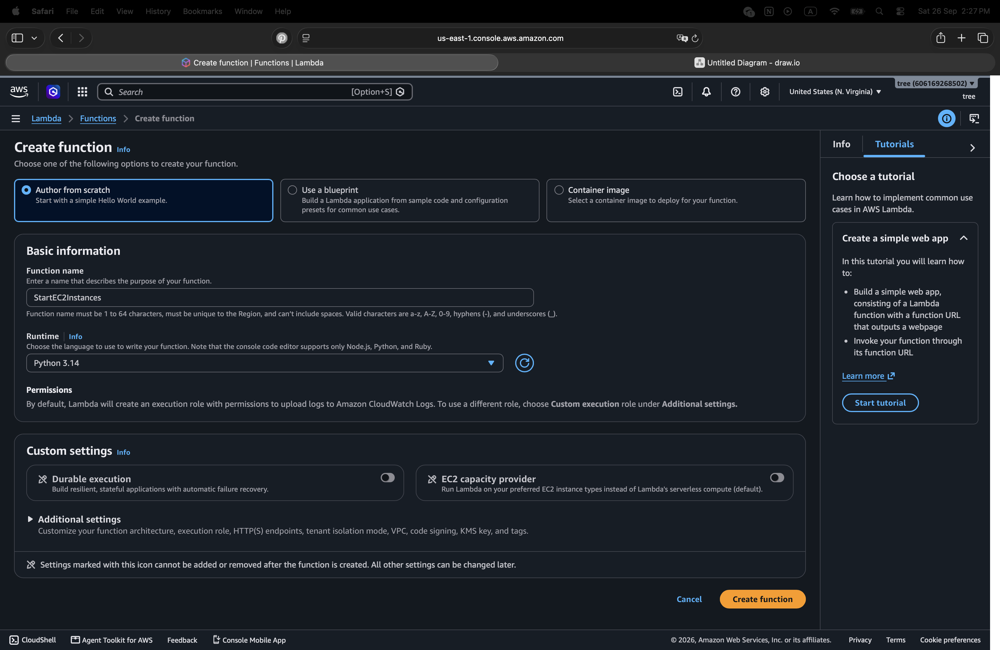
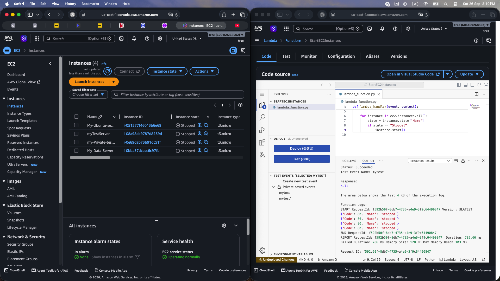
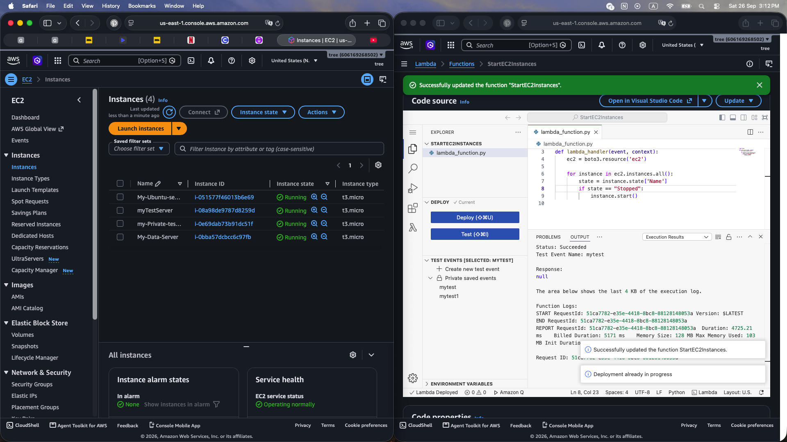
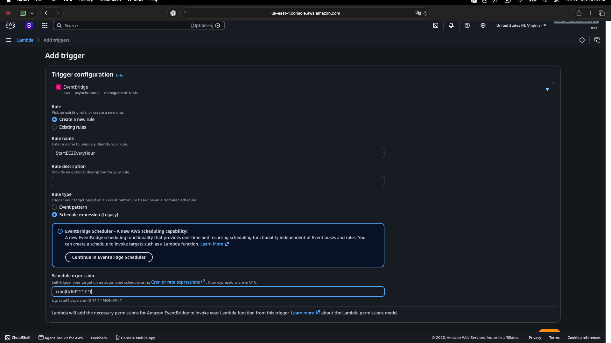
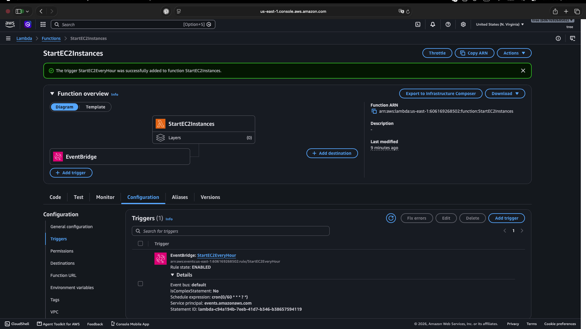

# AWS Lambda EC2 Automation with Boto3

## Overview

This project demonstrates how to use **AWS Lambda, Amazon EventBridge, Amazon EC2, and Boto3** to automate EC2 instance management.

The Lambda function checks the state of EC2 instances and starts any instance that is currently stopped.

Amazon EventBridge triggers the Lambda function on an hourly schedule.

---

## Architecture

```text
Amazon EventBridge
        │
        │ Every 1 hour
        ▼
   AWS Lambda
        │
        │ Python + Boto3
        ▼
    Amazon EC2
        │
        ├── Check instance state
        │
        └── Start stopped instances
```



---

## 1. Create Lambda Function

Created a Lambda function named:

`StartEC2Instances`

Runtime:

`Python 3.14`

The function uses Python and Boto3 to interact with Amazon EC2.



---

## 2. Check EC2 Instance Status

The Lambda function uses Boto3 to access EC2 instances and check their current state.

```python
import boto3

def lambda_handler(event, context):

    ec2 = boto3.resource('ec2')

    for instance in ec2.instances.all():
        print(instance.state)
```

The Lambda function was tested against the EC2 instances and returned their current states.



---

## 3. Start Stopped EC2 Instances

The Lambda function was then configured to start instances when their state is `Stopped`.

```python
for instance in ec2.instances.all():
    state = instance.state['Name']

    if state == "Stopped":
        instance.start()
```

After execution, the previously stopped EC2 instances were started successfully.



---

## 4. Create EventBridge Schedule

An Amazon EventBridge rule was created to trigger the Lambda function every hour.

Rule:

`StartEC2EveryHour`

Schedule:

```text
cron(0/60 * * * ? *)
```



---

## 5. Connect EventBridge to Lambda

The EventBridge rule was connected to the `StartEC2Instances` Lambda function.

The trigger is enabled and configured to invoke the Lambda function according to the hourly schedule.



---

## Workflow

```text
EventBridge
     │
     │ Every hour
     ▼
Lambda Function
     │
     │ Boto3
     ▼
EC2 Instances
     │
     ├── Check state
     │
     └── If Stopped → Start instance
```

---

## Technologies Used

- AWS Lambda
- Amazon EC2
- Amazon EventBridge
- Boto3
- Python 3.14
- AWS IAM
- CloudWatch Logs

---

## Skills Practiced

- AWS Lambda
- Boto3
- EC2 automation
- Event-driven automation
- EventBridge scheduling
- IAM permissions
- Python scripting
- Cloud automation
- AWS monitoring and logs